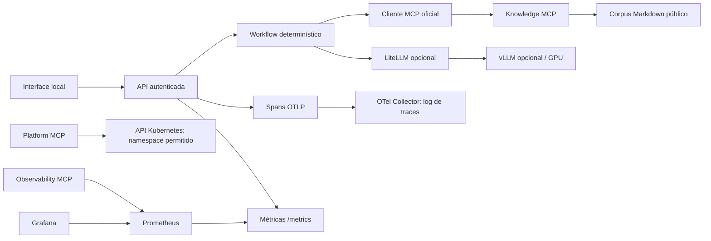
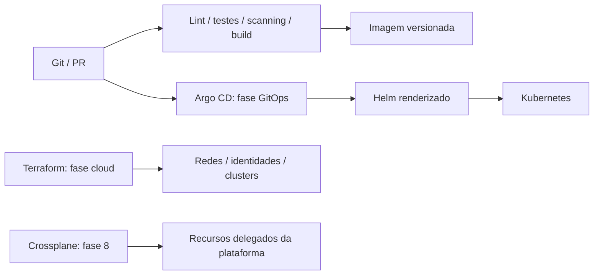

# Arquitetura: estado atual e destino

Endpoints MCP são servidores lógicos independentes em um processo. Isso reduz
custo local, mas compartilha identidade, falha e escala. Separá-los em processos
e ServiceAccounts é requisito para isolamento de produção; o chart concede
somente `list deployments` no próprio namespace a esse processo compartilhado.

Uma pergunta faz uma busca com limite de três resultados via MCP, seguida de
uma geração com limite de tokens. Não há loop autônomo ou tool arbitrária.
Conteúdo recuperado é dado não confiável; prompts de segurança não garantem
isolamento. A ausência de ferramentas mutáveis limita o impacto atual.

O corpus é um snapshot carregado na inicialização; alterações exigem novo
processo/imagem. IDs derivam do caminho relativo permitido e versões do conteúdo.
Não indexar o repositório inteiro: `.env`, state e documentação privada não
pertencem a `knowledge/`. Busca por sobreposição de palavras é baseline lexical,
não similaridade semântica. A fase RAG adicionará chunking, embeddings, filtros,
reranking e avaliações com corpus representativo.

## Delivery e ownership

Terraform e Crossplane não devem controlar o mesmo recurso. Terraform provisiona
o fundamento; Crossplane pode reconciliar recursos por uma API interna depois
que contratos e ownership forem definidos. Atualmente apenas o laboratório
Terraform sem provider externo é executável; AWS/AKS/Crossplane não estão instalados.

## Desenvolvimento versus produção

| Área | Local atual | Antes de produção |
| --- | --- | --- |
| Identidade | Bearer token compartilhado | OIDC/OAuth conforme MCP, audiências, scopes e identidade de usuário |
| Rede | Loopback/ClusterIP; NetworkPolicy de ingress opcional | CNI com enforcement, egress controlado, TLS e ingress autenticado |
| Observabilidade | Prometheus/Grafana efêmeros; traces no log | Retenção, armazenamento, redaction, SLOs e alert routing |
| Serving | Perfil opt-in; um modelo pequeno | Revisão imutável, hardware validado, quotas, benchmark e canary |
| Dados | Markdown público em imagem | ACL por documento, isolamento, exclusão e restore testados |
| Disponibilidade | Uma réplica padrão | Capacidade medida, múltiplas zonas, PDB/autoscaling coerentes |
| Supply chain | Lockfile e versões fixas | Digests, assinatura, SBOM, provenance e atualização contínua |

Não há meta empresarial de capacidade/latência. Nenhuma medição local de HTTP
permite inferir desempenho de GPU, serving ou cloud.
