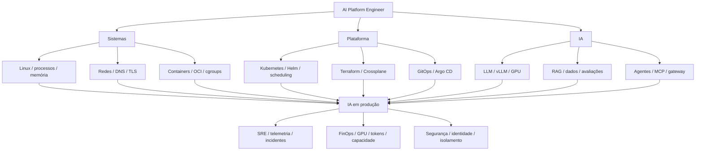

# Mapa de conhecimento

Exemplo de dependência: antes de diagnosticar Pod vLLM Pending, entender requests,
filtering do scheduler, extended resources, device plugin e capacidade dos nodes.
Antes de interpretar latência de geração, separar fila, prefill, decode e rede.
